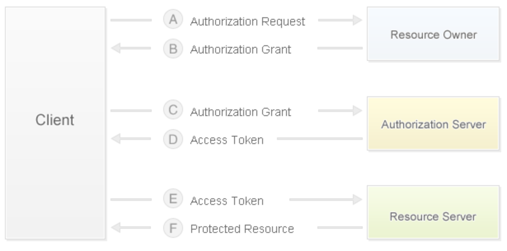

## 电商网站技术要点剖析

### 商业模式

1. B2B - 商家对商家，交易双方都是企业（商家），最典型的案例就是阿里巴巴。
2. C2C - 个人对个人，例如：淘宝、人人车。
3. B2C - 商家对个人，例如：唯品会，聚美优品。
4. C2B - 个人对商家，先有消费者提出需求，后有商家按需求组织生产，例如： 尚品宅配。
5. O2O - 线上到线下，将线下的商务机会与互联网结合，让互联网成为线下交易的平台，例如：美团外卖、饿了么。
6. B2B2C - 商家对商家对个人，例如：天猫、京东。

### 需求要点

1. 用户端
   - 首页（商品分类、广告轮播、滚动快讯、瀑布加载）

   - 用户（登录（第三方登录）、注册、注销、自服务（个人信息、浏览历史、收货地址、……））

   - 商品（分类、列表、详情、搜索、添加到购物车）
   - 购物车（查看、编辑（修改数量、删除商品、清空））
   - 订单（提交订单（支付）、历史订单、订单详情、订单评价）

2. 管理端

### 物理模型设计

两个概念：SPU（Standard Product Unit）和SKU（Stock Keeping Unit）。

- SPU：iPhone 6s
- SKU：iPhone 6s 64G 土豪金


### 第三方登录

第三方登录是指利用第三方网站（通常是知名社交网站）的账号进行登录验证，比如国内的 QQ、微博，国外的Google、Facebook等，第三方登录大部分都是使用[OAuth]()，它是一个关于授权的开放网络标准，得到了广泛的应用，目前通常使用的是2.0版本。关于OAuth的基础知识，可以阅读阮一峰老师的[《理解OAuth 2.0》](http://www.ruanyifeng.com/blog/2014/05/oauth_2_0.html)。

#### OAuth 2.0授权流程

1. 用户打开客户端以后，客户端要求用户（资源所有者）给予授权。
2. 用户（资源所有者）同意给予客户端授权。
3. 客户端使用上一步获得的授权，向认证服务器申请访问令牌。
4. 认证服务器对客户端进行认证以后，发放访问令牌。
5. 客户端使用访问令牌向资源服务器申请获取资源。
6. 资源服务器确认访问令牌无误，同意向客户端开放资源。



如果使用微博登录进行接入，其具体步骤可以参考微博开放平台上的[“微博登录接入”](http://open.weibo.com/wiki/Connect/login)文档。使用QQ登录进行接入，需要首先注册成为QQ互联开发者并通过审核，具体的步骤可以参考QQ互联上的[“接入指南”](http://wiki.connect.qq.com/)，具体的步骤可以参考[“网站开发流程”](http://wiki.connect.qq.com/%E5%87%86%E5%A4%87%E5%B7%A5%E4%BD%9C_oauth2-0)。在Gitbook上面有一本名为[《Django博客入门》](https://shenxgan.gitbooks.io/django/content/publish/2015-08-10-django-oauth-login.html)的书以Github为例介绍了第三方账号登录，有兴趣的可以自行阅读。

通常电商网站在使用第三方登录时，会要求与网站账号进行绑定或者根据获取到的第三方账号信息（如：手机号）自动完成账号绑定。

### 缓存预热和查询缓存

#### 缓存预热

所谓缓存预热，是指在启动服务器时将数据提前加载到缓存中，为此可以在Django应用的`apps.py`模块中编写`AppConfig`的子类并重写`ready()`方法，代码如下所示。

```Python
import pymysql

from django.apps import AppConfig
from django.core.cache import cache

SELECT_PROVINCE_SQL = 'select distid, name from tb_district where pid is null'


class CommonConfig(AppConfig):
    name = 'common'

    def ready(self):
        conn = pymysql.connect(host='1.2.3.4', port=3306,
                               user='root', password='pass',
                               database='db', charset='utf8',
                               cursorclass=pymysql.cursors.DictCursor)
        try:
            with conn.cursor() as cursor:
                cursor.execute(SELECT_PROVINCE_SQL)
                provinces = cursor.fetchall()
                cache.set('provinces', provinces)
        finally:
            conn.close()
```

接下来，还需要在应用的`__init__.py`中编写下面的代码。

```Python
default_app_config = 'common.apps.CommonConfig'
```

或者在项目的`settings.py`文件中注册应用。

```Python
INSTALLED_APPS = [
    ...
    'common.apps.CommonConfig',
    ...
]
```

#### 查询缓存

```Python
from pickle import dumps
from pickle import loads

from django.core.cache import caches

MODEL_CACHE_KEY = 'project:modelcache:%s'


def my_model_cache(key, section='default', timeout=None):
    """实现模型缓存的装饰器"""

    def wrapper1(func):

        def wrapper2(*args, **kwargs):
            real_key = '%s:%s' % (MODEL_CACHE_KEY % key, ':'.join(map(str, args)))
            serialized_data = caches[section].get(real_key)
            if serialized_data:
                data = loads(serialized_data)
            else:
                data = func(*args, **kwargs)
                cache.set(real_key, dumps(data), timeout=timeout)
            return data

        return wrapper2

    return wrapper1
```

```Python
@my_model_cache(key='provinces')
def get_all_provinces():
    return list(Province.objects.all())
```

### 购物车实现

问题一：已登录用户的购物车放在哪里？未登录用户的购物车放在哪里？

```Python

class CartItem(object):
    """购物车中的商品项"""

    def __init__(self, sku, amount=1, selected=False):
        self.sku = sku
        self.amount = amount
        self.selected = selected

    @property
    def total(self):
        return self.sku.price * self.amount


class ShoppingCart(object):
    """购物车"""

    def __init__(self):
        self.items = {}
        self.index = 0

    def add_item(self, item):
        if item.sku.id in self.items:
            self.items[item.sku.id].amount += item.amount
        else:
            self.items[item.sku.id] = item

    def remove_item(self, sku_id):
        if sku_id in self.items:
            self.items.remove(sku_id)

    def clear_all_items(self):
        self.items.clear()

    @property
    def cart_items(self):
        return self.items.values()

    @property
    def cart_total(self):
        total = 0
        for item in self.items.values():
            total += item.total
        return total
```

已登录用户的购物车可以放在Redis中；未登录用户的购物车可以保存在Cookie中。

```JSON
{
    '1001': {sku: {...}, 'amount': 1, 'selected': True}, 
    '1002': {sku: {...}, 'amount': 2, 'selected': False},
    '1003': {sku: {...}, 'amount': 3, 'selected': True},
}
```

```Python
request.get_signed_cookie('cart')

cart_base64 = base64.base64encode(pickle.dumps(cart))
response.set_signed_cookie('cart', cart_base64)
```

问题二：用户登录之后，如何合并购物车？


### 集成支付功能


### 秒杀和超卖


### 静态资源管理


### 全文检索

####  方案选择

1. 使用数据库的模糊查询功能 - 效率低，每次需要全表扫描，不支持分词。
2. 使用数据库的全文检索功能 - MySQL 5.6以前只适用于MyISAM引擎，检索操作和其他的DML操作耦合在数据库中，可能导致检索操作非常缓慢，数据量达到百万级性能显著下降，查询时间很长。
3. 使用开源搜索引擎 - 索引数据和原始数据分离，可以使用ElasticSearch或Solr来提供外置索引服务。

#### ElasticSearch

ElasticSearch是一个高可扩展的开源全文搜索和分析引擎，它允许存储、搜索和分析大量的数据，并且这个过程是近实时的。它通常被用作底层引擎和技术，为复杂的搜索功能和要求提供动力，大家熟知的维基百科、Stack-Overflow、Github都使用了ElasticSearch。

ElasticSearch的底层是开源搜索引擎[Lucene](https://lucene.apache.org/)。但是直接用Lucene会非常麻烦，必须自己编写代码去调用它的接口而且只支持Java语言。ElasticSearch相当于是对Lucene进行了封装，提供了REST API的操作接口。搜索引擎在对数据构建索引时，需要进行分词处理。ElasticSearch不支持基于中文分词的索引，需要配合扩展elasticsearch-analysis-ik来实现中文分词处理。


#### Django对接ElasticSearch

Python对接ElasticSearch的工具HayStack

```shell
pip install django-haystack elasticsearch
```

